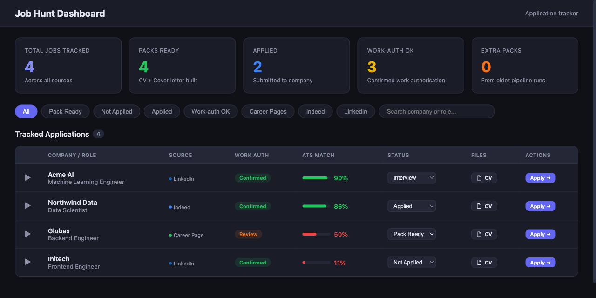

# Job Hunt

A Claude Code plugin that finds jobs, writes fabrication-checked tailored CVs
and cover letters from your own past CVs, and applies for you — with a human
in the loop for every irreversible step. It is region-agnostic: you choose
which job platforms to search and which work-authorisation scheme (if any)
applies to you as plain settings, not hardcoded logic.

The plugin ships as five slash commands that share one workspace and one
engine: `/job-setup` → `/job-search` → `/job-tailor` → `/job-apply` →
`/job-track`.

## Dashboard preview

The optional `/job-track dashboard` gives you a local web view of every
application — work-authorisation status, **ATS match score**, the generated CV /
cover-letter files, and quick apply links:



_(Sample data shown; the dashboard runs locally on `127.0.0.1` and reads only
your own workspace.)_

## Install

```
/plugin marketplace add Baxter-Labs/job-hunt
/plugin install job-hunt
```

## Setup (one-time)

The engine needs one Python dependency, `pypdf`, to read your CV PDFs. Install
it into the Python you'll use (from the installed plugin directory, i.e.
`${CLAUDE_PLUGIN_ROOT}`):

```bash
pip install -r plugins/job-hunt/scripts/requirements.txt
```

Prefer an isolated environment? Create a venv and install there:

```bash
python3 -m venv .venv
.venv/bin/pip install -r plugins/job-hunt/scripts/requirements.txt
```

That same requirements file also lists two **optional** extras — install them
if you want the features they unlock:

- `weasyprint` — higher-fidelity PDF rendering for `/job-tailor`. Without it,
  the renderer still produces a PDF (falling back through wkhtmltopdf, then
  reportlab, then a dependency-free stdlib writer), just plainer.
- `flask` — only needed for the optional `/job-track dashboard` web view. The
  default text summary never imports Flask.

Every command will tell you if a dependency it needs is missing, rather than
failing silently. Once `pypdf` is installed, run:

```
/job-setup
```

## Commands

| Command | What it does |
|---|---|
| `/job-setup` | One-time: creates your workspace, writes `profile.json` (contact, target locations, platforms, work-auth scheme, apply preferences), and imports your existing CV PDF(s) into a validated `cv_master.json`. |
| `/job-search` | Runs only the platforms you selected in your profile, annotates each company with your work-authorisation status, drops anything you've already tracked or packaged, ranks what's left, and shows you a table of new roles. |
| `/job-tailor` | Takes a job description and produces a tailored CV + cover letter (PDF), an ATS match score with missing keywords, and a change log — grounded entirely in facts already in your master CV. |
| `/job-apply` | Assisted apply: shows you the pack's ATS score first, opens the apply page, prefills only safe non-secret contact fields, attaches your pack, and stops at any CAPTCHA, login, or consent step. |
| `/job-track` | Prints a text summary of your application tracker by default, or launches a local dashboard with `dashboard`. |

### Example flow

```
/job-setup
  → creates ~/.job-hunt, walks you through profile.json, imports your CV(s)

/job-search
  → queries the platforms in your profile, shows a ranked table of new roles
  → you pick which ones to prepare: "1,3"

/job-tailor
  → tailors your CV + writes a cover letter for the JD, reports ATS score
    and missing keywords, fails loud if anything looks fabricated

/job-apply
  → shows the ATS score again, opens the apply page, prefills your contact
    fields, attaches the pack, and stops the moment a CAPTCHA/login/consent
    step appears — you take it from there

/job-track
  → "3 tracked, 1 applied, 2 discovered" — or /job-track dashboard for a
    local browser view with download links
```

## How it works

**Workspace vs. code.** The plugin's code never holds your personal data.
Everything you put in — contact details, target locations, your master CV,
every tailored pack, your application tracker — lives in a workspace at
`$JOB_HUNT_HOME` (default `~/.job-hunt/`): `profile.json`, `cv_master.json`,
`output/<company>-<role>/` packs, and `tracker.csv`. Passwords are never
stored or typed by the plugin, anywhere.

**Region as settings, not code.** There's nothing Netherlands-specific,
India-specific, or otherwise regional baked into the plugin. `/job-setup`
asks which platforms to search (`linkedin`, `indeed`, `naukri`,
`career_pages`, `greenhouse_lever` — pick any combination) and which
work-authorisation scheme applies to you:

- `nl-ind-hsm` — checks companies against the Dutch IND recognised-sponsor
  register (cached locally; confirmed / possible / not-found).
- `eu-blue-card` — no single authoritative employer register exists, so this
  scheme flags every role for manual salary/threshold review rather than
  guessing.
- `none` — no sponsorship filter (e.g. searching domestically).

`/job-search` only queries the platforms you picked, and only applies the
work-auth scheme you picked.

**ATS score and fabrication check.** `/job-tailor` never invents anything.
Claude may only reorder, rephrase, and re-emphasise facts already present in
your `cv_master.json`; a deterministic, code-level fabrication check (never
the model) then compares the tailored output's contact info, every
`(company, title, dates)` triple, and every listed skill against the master,
and fails loudly if anything doesn't match. The ATS match score is an honest
keyword-coverage number computed against the job description — never a
reason to add a claim you don't genuinely have. Keywords you're missing are
reported as gaps for you to decide on, not silently inserted.

**Assisted apply, not auto-apply.** `/job-apply` drives a real browser via
the Playwright MCP, but a human stays in control of every irreversible step.
It shows you the ATS score before it opens anything, fills in only
non-secret contact fields, attaches your pack, and halts immediately at any
CAPTCHA, login/SSO step, consent/terms acceptance, or request for sensitive
data. Clicking submit requires your confirmation unless you've explicitly
opted in to `apply_prefs.auto_submit_simple_forms` — and even then, it still
halts at any CAPTCHA, login, or consent step and never handles credentials.

## Requirements

- **Python** with `pypdf` installed (required). `weasyprint` and `flask` are
  optional extras — see [Setup](#setup-one-time) above.
- **MCP tools**, brought by you, not bundled with the plugin:
  - An **Indeed MCP** for the `indeed` platform.
  - A **LinkedIn scraper MCP** (or a logged-in browser session via
    Playwright) for the `linkedin` platform.
  - A **Playwright MCP** for `naukri`, `career_pages`, `greenhouse_lever`,
    and for all of `/job-apply`.

If a platform's tool isn't available in a session, `/job-search` skips that
platform and says so explicitly — it never fakes or approximates results.
See [docs/REQUIREMENTS.md](docs/REQUIREMENTS.md) for the full breakdown per
command and feature.

## Privacy & safety

- All personal data lives in your workspace (`$JOB_HUNT_HOME`, default
  `~/.job-hunt/`), never in the plugin's code.
- Passwords, credentials, tokens, and 2FA codes are never stored, typed, or
  asked for. You authenticate your own platform sessions.
- `/job-apply` never solves a CAPTCHA and never accepts terms/consent on your
  behalf — it stops and hands control back to you.
- The optional `/job-track dashboard` is a local Flask app bound to
  `127.0.0.1` only, serving files from an explicit allow-list.
- Nothing is uploaded or shared outside the tools you explicitly authorize
  (your chosen MCP tools) and the workspace on your own disk.

## Extending

Adding a new work-authorisation scheme or wiring up a new platform doesn't
require touching the skills' prompts — see
[docs/EXTENDING.md](docs/EXTENDING.md) for the provider interface and the
registry you plug into.
